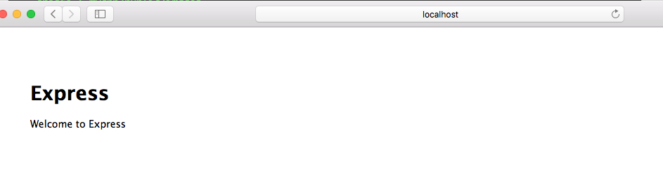
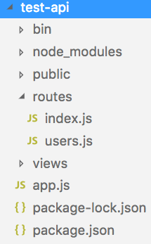
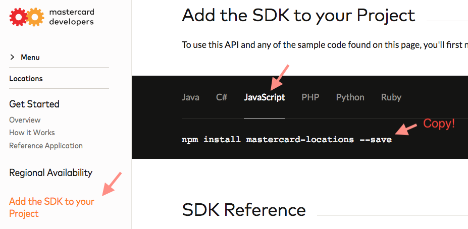
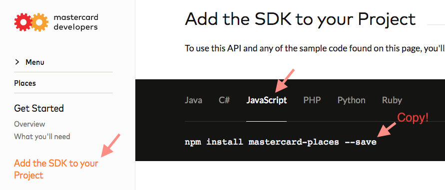
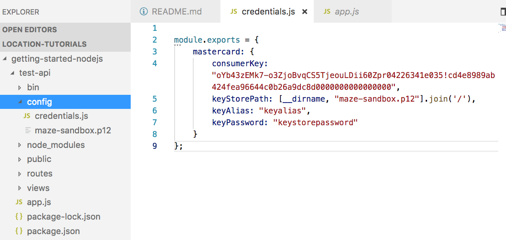
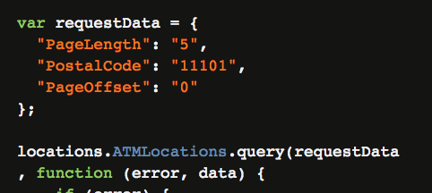
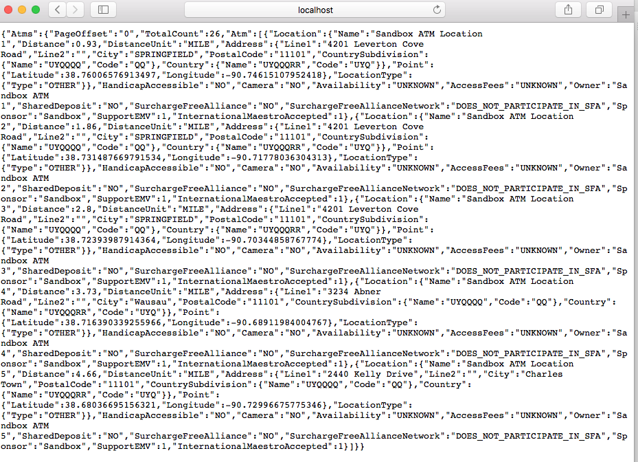
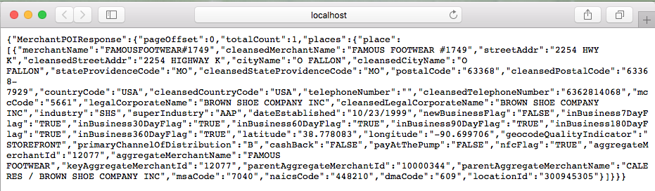

# GETTING STARTED

## 1. Overview
Access Mastercard's global database of merchant and ATM locations for use in your app or website.
We have APIs to provide you with the information you need.
* [Locations](https://developer.mastercard.com/documentation/locations/): ATM, Contactless, rePower, and Travel Card merchants
* [Places](https://developer.mastercard.com/documentation/places/): Merchant location details

### What you'll learn
* Install Mastercard SDK in your project 
* Configure Mastercard API keys in your project
* Effortlessly test locations and places APIs with code samples from API documentation

### What you'll need
* About 15 minutes
* Any text editor or your favourite IDE
* A PCKS#12 certificate (.p12) and a sandbox key of an API project tied to your Mastercard developers's account. See [Sign up for a Mastercard Developers account](https://developer.mastercard.com/tutorial/sign-up-for-a-mastercard-developers-account?lang=#overview) and [Creating a project on Mastercard Developers](https://developer.mastercard.com/tutorial/creating-a-project-on-mastercard-developers) if you haven't created one yet
    > **Tip**: If you have lost your PCKS#12 certificate file (.p12), you can delete and re-create the project to generate a new file


## 2. Setup a simple NodeJS/Espress application
* Download and install NodeJS from https://nodejs.org/en/

* Install Express application generator
    ```
    npm install express-generator -g
    ```

* Initialize a simple test-api nodejs/express application 
    ```
    express --no-view test-api   
    ```

* Install dependencies and test run the app
    ```
    cd test-api
    npm install
    npm start
    ```

* Open http://localhost:3000/ in your browser to access the app


* Your project should have the following structure


## 3. Install Mastercard SDK in your project
* Look up Locations API's SDK package & copy the sample command


* Execute the command to install the Locations API's SDK
    ```
    npm install mastercard-locations --save
    ```

* Repeat above steps to install the Places API's SDK


    ```
    npm install mastercard-locations --save
    ```

## 4. Configure Mastercard API credentials
* Create a `config` folder to store Mastercard API credentials
* Create `credentials.js` file under `config` folder to store mastercard credentials. For example:
    ```
    module.exports = {
        mastercard: {
            consumerKey: "YOUR CONSUMER KEY", 
            keyStorePath: "[PATH TO YOUR .P12 FILE]",
            keyAlias: "keyalias",       
            keyPassword: "keystorepassword"
        }
    };
    ```
    > **Tip**: If you store .p12 file in the same `config` folder, `keyStorePath` can have value `[__dirname, "project-name-sandox-key.p12"].join('/')`

    

## 5. Write code to call [Locations' ATM Locations API](https://developer.mastercard.com/documentation/locations/#api_atm_locations)
* Under `routes` folder, create `locations.js` to house Locations API-related codes
* Copy and paste the following code to `locations.js`
    ```
    var express = require('express');
    var router = express.Router();

    //mastercard credential
    var credentials = require('../config/credentials');
    var consumerKey = credentials.mastercard.consumerKey;
    var keyStorePath = credentials.mastercard.keyStorePath;
    var keyAlias = credentials.mastercard.keyAlias;
    var keyPassword = credentials.mastercard.keyPassword;

    //location api
    var locations = require('mastercard-locations');
    var initialized = false;

    function init(){
        // You only need to do initialize MasterCardAPI once
        if (initialized) return;

        var MasterCardAPI = locations.MasterCardAPI;
    
        // For production, set sandbox: false
        var authentication = new MasterCardAPI.OAuth(consumerKey, keyStorePath, keyAlias, keyPassword);
        MasterCardAPI.init({
            sandbox: process.env.NODE_ENV != "production" ,
            authentication: authentication
        });

        initialized = true;
    }

    /* ATM Location . */
    router.get('/atmlocation', getAtmLocation);

    function getAtmLocation(req, res, next) {
        init();
    
        var requestData = {
        "PageLength": "5",
        "PostalCode": "11101",
        "PageOffset": "0"
        };
    
        locations.ATMLocations.query(requestData
        , function (error, data) {
            if (error) {
                res.status = 500;
                res.send(error);
            }
            else {
                res.send(data);
            }
        }); 
    }
    module.exports = router;
    ```

    > **Note**: If you compare the above code with the sample NodeJS code of [ATM Locations API](https://developer.mastercard.com/documentation/locations/#api_atm_locations), the above contains 2 notable differences:
    > * API initialization codes are extracted to a common method. This is  useful when you write code to invoke other Locations API
    > * All `console.error` and `console.log` are replaced by `res.send(error)` and `res.send(data)` to send API response on a browser
    >
    > Essentially, that means you only need to copy sample `var requestData = ...` and API name (`ATMLocations` in `locations.ATMLocations.query...`) from the API's sample code in order to invoke the API. That's how easy it is to start using Locations API with the Mastercard SDK
    > 

* Finally, map locations-related requests in `app.js` file with the following code
    ```
    var express = require('express');
    var path = require('path');
    var cookieParser = require('cookie-parser');
    var logger = require('morgan');

    var indexRouter = require('./routes/index');
    var usersRouter = require('./routes/users');
    var locationRouter = require('./routes/locations'); //added: load locations.js code

    var app = express();

    app.use(logger('dev'));
    app.use(express.json());
    app.use(express.urlencoded({ extended: false }));
    app.use(cookieParser());
    app.use(express.static(path.join(__dirname, 'public')));

    app.use('/', indexRouter);
    app.use('/users', usersRouter);
    app.use('/locations', locationRouter);  //added: map locations-related requests

    module.exports = app;
    ```
* Start the server
    ```
    npm start
    ```
* Test the API on a browser: http://localhost:3000/locations/atmlocation. Notice how `locations` and `atmlocation` fragments are mapped in `app.js` and `locations.js` files


## 6. (Reinforcement) Write code to call [Places' Merchant Point of Interest API](https://developer.mastercard.com/documentation/places/1#api_merchant_point_of_interest)
* Under `routes` folder, create `places.js` to house Places API-related codes
* Copy and paste the following credentials preparation and initialization code to `places.js`
    > Observe how similar they are to their counterparts in `locations.js`
    ```
    var express = require('express');
    var router = express.Router();

    //mastercard credential
    var credentials = require('../config/credentials');
    var consumerKey = credentials.mastercard.consumerKey;
    var keyStorePath = credentials.mastercard.keyStorePath;
    var keyAlias = credentials.mastercard.keyAlias;
    var keyPassword = credentials.mastercard.keyPassword;

    //places api
    var places = require('mastercard-places');
    var initialized = false;

    function init(){
        // You only need to do initialize MasterCardAPI once
        if (initialized) return;

        var MasterCardAPI = places.MasterCardAPI;
    
        // For production, set sandbox: false
        var authentication = new MasterCardAPI.OAuth(consumerKey, keyStorePath, keyAlias, keyPassword);
        MasterCardAPI.init({
            sandbox: process.env.NODE_ENV != "production" ,
            authentication: authentication
        });

        initialized = true;
    }
    module.exports = router;
    ```
* Fill in the routing and API invocation codes
    > Observe that we need only copy the sample `var requestData = ...` and API name (`MerchantPointOfInterest`) from the API's sample code in order to invoke the API
    ```
    //routing
    router.get('/merchantPOI', getMerchantPOI);

    function getMerchantPOI(req, res, next){
        init();
    
        var requestData = {
            "pageOffset": "0",
            "pageLength": "10",
            "radiusSearch": "false",
            "unit": "km",
            "distance": "14",
            "place": {
                "locationId": "300945305",
                "countryCode": "USA"
            }
        };

        places.MerchantPointOfInterest.create(requestData
        , function (error, data) {
            if (error) {
                res.status = 500;
                res.send(error);
            }
            else {
                res.send(data);
            }
        });
    }

    module.exports = router;
    ```
  
* Lastly, map places-related requests in `app.js` file with the following code
    ```
    var placesRouter = require('./routes/places'); //added: load places.js code
    
    app.use('/places', placesRouter);  //added: map places-related requests
    ```
* Start the server
    ```
    npm start
    ```
* Test the API on a browser: http://localhost:3000/places/merchantPOI


## 7. Summary
Congratulation! You have learned to:
* Install Mastercard SDK of [Locations](https://developer.mastercard.com/documentation/locations/) and [Places](https://developer.mastercard.com/documentation/places/) APIs
* Configure Mastercard API keys and use them when making API requests
* Effortlessly write code to invoke locations and places APIs with code samples from API documentation

## 8. See also
* [Sign up for a Mastercard Developers account](https://developer.mastercard.com/tutorial/sign-up-for-a-mastercard-developers-account?lang=#overview)
* [Creating a project on Mastercard Developers](https://developer.mastercard.com/tutorial/creating-a-project-on-mastercard-developers) 
* [Use Insomnia REST Client for Mastercard APIs](https://developer.mastercard.com/tutorial/use-insomnia-rest-client-for-mastercard-apis)
* [Tutorial - Merchant-of-interest PWA with Places API](https://developer.mastercard.com/tutorial/locations-api-merchant-of-interest-pwa-app-with-places-api)